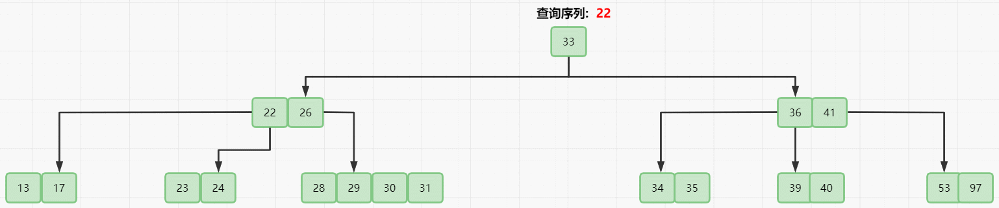
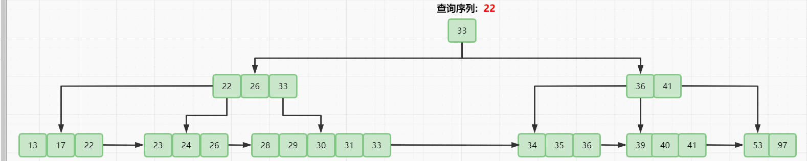
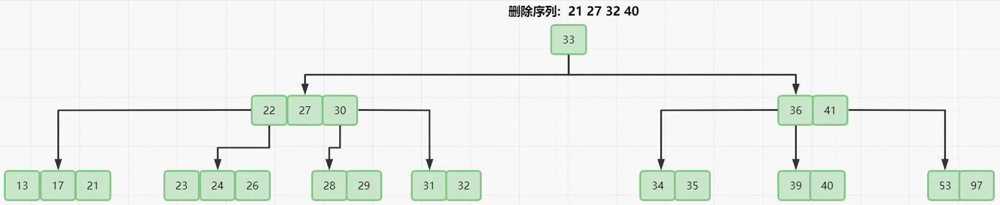

# B Tree

## 简单介绍一下B树

B树(Balance-Tree)全称为**平衡多路查找树**,被用于数据库中的索引部分.
其效率的体现在于其名称中的**平衡**和**多路**两部分,
平衡使得树高度变低，查询路径变短，多路使得IO操作减少，增加处理速度。
这两部分如果无法理解的话请先看看平衡树和多路查找树。

而B树就是带有规则约束的平衡树与多路查找树结合体。

一棵M阶B树有以下特点。
- 每个结点的值(索引) 都是按递增次序排列存放的，并遵循左小右大原则。
- 根结点的子节点个数为 [2，M]。
- 除根结点以外的非叶子结点的子节点个数为[ Math.ceil(M/2)，M]。
- 非叶子结点的值(索引)个数 = 子节点个数 -1 。最小为 Math.ceil(M/2)-1   最大为 M-1 个。
- B树的所有叶子结点都位于同一层。

而在B树的基础之上改进一下得到B+树

- B+树内部有两种结点，一种是索引结点，一种是叶子结点。
- B+树的索引结点并不会保存记录，只用于索引，所有的数据都保存在B+树的叶子结点中。而B树则是所有结点都会保存数据。
- B+树的叶子结点都会被连成一条链表。叶子本身按索引值的大小从小到大进行排序。即这条链表是 从小到大的。多了条链表方便范围查找数据。
- B树的所有索引值是不会重复的，而B+树 非叶子结点的索引值 最终一定会全部出现在 叶子结点中。
  B+Tree是B TREE的变种，B TREE能解决的问题，B+TREE也能够解决（降低树的高度，增大节点存储数据量）

相比起来，B树的每一个结点都包含key(索引值) 和 value(对应数据)，因此方位离根结点近的元素会更快速,
但是B+树更利于范围查找(区间查找)，可以直接通过遍历链表实现范围查找，并且磁盘读写能力更强，排序能力更强，也更稳定。

> 个人总结B+树强就强在叶节点链以及索引这两点，下面给出两种树的查询过程

**B Tree**:

**B+ Tree**: 

## 插入

B树的插入操作核心在于结点有序存储和规则约束下的上溢处理。

结点有序存储即保证结点中存储的值是有序排列的

上溢即插入后当前结点超出了单节点存储数量的上限,则进行分裂，中间值并入双亲结点

## 删除

最难的还得是删除操作,删除操作首先考虑旋转再考虑合并

旋转是当直接删除后结点不符合规则时，考虑向左右兄弟借值加入双亲结点，而双亲结点的值填补被删除的位置

而当都借不到时，就要把自身结点与左兄弟或者右兄弟和双亲结点一起合并形成新结点

## 实现操作
当我看懂了B树后,我麻了,因为我对于怎么正确实现并没有思路(蒟蒻落泪),请等我抽空写出来并测试正确后再来填坑吧。

