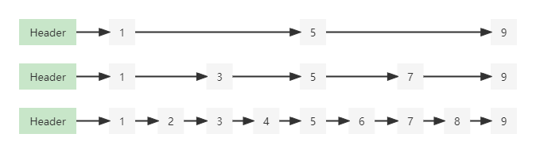

# SkipList 跳表

## 什么是跳表
跳表是一种据说可以替代红黑树的数据结构,空间复杂度为O(n),时间复杂度为O($log_n$)，在Redis中的有序集合就是用的跳表，(听说Kafka也用到了,但是我没继续深入调查了)。

虽然顶着硬刚红黑树的名声，但是远比红黑树易实现得多，可以理解为二分查找的链表(二分查找我会，链表我也会，跳表没理由不会啊《认真》),
其跳表中的“跳”我个人理解为跳线中的那个"跳"，目的就是缩短路径，而缩短路径的代价就是用空间换时间。

所以跳表长啥样？现在请看跳表第一眼。

<div align=center>

</div>

这是个啥？请再看第二眼。

<div align=center>

</div>

可能有点感觉了？我们再看第三眼。

<div align=center>

</div>

看出了链表的模样了吗？我们再拿一个单链表出来比较:

<div align=center>

</div>

应该恍然大悟了，原来跳表就是带"跳线"的链表啊。

## 跳表是如何工作的
跳表是划分了层级的，第0层是原始链表，越上层跳的越高越远，元素越少，上层链表是下层链表的子序列，查找时从顶层向下，不断缩小搜索范围。

> 看不懂?上动图,我们可以看到下图中查询6的时候，经过的查询路径是1->5->6

<div align=center>

</div>

当我学到这里时，我已经大概知道跳表该怎么实现了。
> **是时候拿下它了**

## 结构定义

<div align=center>

</div>

结构上简要来说就是在链表的基础之上，其原先的单指针域变成了指针组域来存放多个跳线。给个最大层数`maxLevel`,就最多几层开几层的空间罢了。注意看`forwards`。

另外由于分了层级，所以我们的next就变成了传入层级的方法，以正确实现我们的功能
```java
private static class Node<T> {
        T data;
        List<Node<T>> forwards;

        Node(T data, int maxLevel){
            this.data = data;
            forwards = new ArrayList<>();
            for(int i = 0; i <= maxLevel; ++i){
                forwards.add(null);
            }
        }


        Node<T> next(int level) {
            return this.forwards.get(level);
        }

        @Override
        public String toString() {
            return data == null ? " " : "" + data;
        }
    }
```
## 查询

查询过程上面已经阐释过了所以不再赘述，总之就是从最高层开始找到当前层最接近查询值的地方向下层探索，直到找到或者查无此值。

```java
public Node<T> find(T data) {
    if (this.header == null) {
        return null;
    }
    return header.find(data, this.header, maxLevel);
}

private Node<T> findNext(T data, Node<T> current, int level) {
    Node<T> next = current.next(level);
    while (next != null) {
        if (data.compareTo(next.data) < 0) break;
        current = next;
        next = current.next(level);
    }
    return current;
}

private Node<T> find(T data, Node<T> header, int level) {
    Node<T> current = header;
    while (level >= 0) {
        current = findNext(data, current, level);
        level--;
    }
    return current;
}


```

## 插入
插入操作首先遵循基本的链表插入方式，即先找到插入位置，再改变相应的指针。然后再考虑一下层级关系的处理。就能完成插入了。

> 高级(多了一点步骤)的链表插入
```java
Node newNode = new Node(e);
Node current = head;
while (level >= 0) {
    current = findNext(e, current, level);
    newNode.forwards.add(0, current.next(level));
    current.forwards.set(level, newNode);
    level--;
}
```

但是其中涉及到一个问题就是该插入第几层?答案是随机。但也不是完全随机，而是按照0层开始往上的概率越来越少
```java
private int randomLevel() {
    int level = 0;
    while (Math.random() < PROBABILITY && level < maxLevel - 1) {
        ++level;
    }
    return level;
}
```

## 删除
至于删除也同样如此，可以理解为一层层的删除就好了

```java
while (level >= 0) {
    while (current != null) {
        if (e.compareTo(current.data) < 0) break;

        if (e.compareTo(current.data) == 0) {
            pre.forwards.set(level, current.next(level));
            removed = true;
            break;
        }
        pre = current;
        current = current.next(level);
    }
    level--;
    if (level < 0) break;

    current = pre.next(level);
}
```

