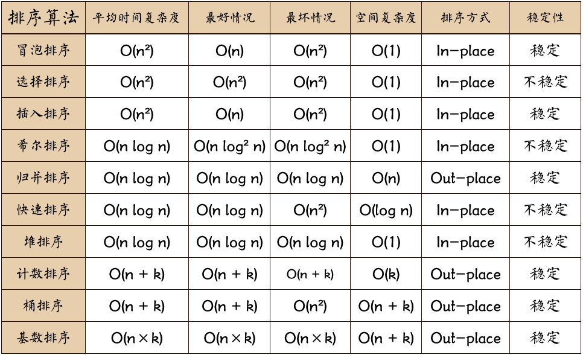
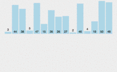
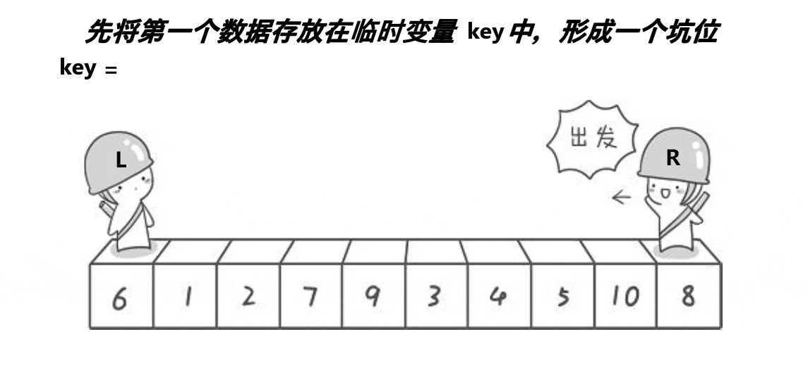

# 排序算法

备注:所有具体代码请看代码文件.

## 冒泡排序
### 介绍
通过相邻元素两两交换来让元素一点一点挪向有序位。

1. 比较相邻的元素。如果第一个比第二个大，就交换它们两个；
2. 对每一对相邻元素作同样的工作，从开始第一对到结尾的最后一对，这样在最后的元素应该会是最大的数；
3. 针对所有的元素重复以上的步骤，除了最后一个；
4. 重复步骤1~3，直到排序完成。

### 改进
冒泡排序的改进主要着手于两点

- 排序过程中已经有序的情况我们可以退出排序

- 一趟排序后可能有序的元素增加不止一个，如:\
    3 4 2 1 5 6 7 8\
    在第一趟排序后变成了\
    3 4 1 2 $\underline{5 6 7 8}$\
    那么我们可以找到并标记来减少比较趟数。

## 选择排序
### 介绍
每次从无序区间中选择最小（最大） 放入无序区间最前（最后）位置 ，直到所有元素都排完

1. 初始状态：无序区为R[1…n]，有序区为空；
2. 第i趟排序(i=1,2,3…n-1)开始时，当前有序区和无序区分别为R[1…i-1]和R(i…n）。
   该趟排序从当前无序区中-选出关键字最小的记录 R[k]，将它与无序区的第1个记录R交换，
   使R[1…i]和R[i+1…n)分别变为记录个数增加1个的新有序区和记录个数减少1个的新无序区；
3. n-1趟结束，数组有序化了。

### 改进
选择排序可以改进为双向，即同时选择最大值和最小值。

但是需要注意 当数组中最大元素在第一个位置时 经过与min 交换 当前最大元素下标发生变更 需特殊处理

## 插入排序
### 介绍
通过构建有序序列，对于未排序数据，在已排序序列中从后向前扫描，找到相应位置并插入。

1. 从第一个元素开始，该元素可以认为已经被排序；
2. 取出下一个元素，在已经排序的元素序列中从后向前扫描；
3. 如果该元素（已排序）大于新元素，将该元素移到下一位置；
-4. 重复步骤3，直到找到已排序的元素小于或者等于新元素的位置；
4. 将新元素插入到该位置后；
5. 重复步骤2~5。

### 改进
参考希尔排序

## 希尔排序
### 介绍
希尔排序是把记录按下表的一定增量分组，对每组使用直接插入排序算法排序；
随着增量逐渐减少，每组包含的关键词越来越多，当增量减至1时，整个文件恰被分成一组，算法便终止。

- 步骤1：选择一个增量序列t1，t2，…，tk，其中ti>tj，tk=1；
- 步骤2：按增量序列个数k，对序列进行k 趟排序；
- 步骤3：每趟排序，根据对应的增量ti，将待排序列分割成若干长度为m 的子序列，分别对各子表进行直接插入排序。仅增量因子为1 时，整个序列作为一个表来处理，表长度即为整个序列的长度。

## 归并排序
### 简介
将已有序的子序列合并，得到完全有序的序列；
即先使每个子序列有序，再使子序列段间有序。
若将两个有序表合并成一个有序表，称为2-路归并

其操作主要分为分与并两部分，其中分体现的分治思想，并利用的双指针。

算法描述
1. 把长度为n的输入序列分成两个长度为n/2的子序列；
2. 对这两个子序列分别采用归并排序；
3. 将两个排序好的子序列合并成一个最终的排序序列。

### 改进
- 原地归并
- 结合插入排序

## 快速排序
### 介绍
通过一趟排序将待排记录分隔成独立的两部分，其中一部分记录的关键字均比另一部分的关键字小，
则可分别对这两部分记录继续进行排序，以达到整个序列有序。

算法描述

1. 从数列中挑出一个元素，称为 “基准”（pivot ）；
2. 步骤2：重新排序数列，所有元素比基准值小的摆放在基准前面，所有元素比基准值大的摆在基准的后面（相同的数可以到任一边）。在这个分区退出之后，该基准就处于数列的中间位置。这个称为分区（partition）操作；
3. 步骤3：递归地（recursive）把小于基准值元素的子数列和大于基准值元素的子数列排序。

### 参考排序过程
注意快排有hoare版,挖坑法,前后指针法三种写法

**hoare版**

**挖坑法**

**前后指针法**

缺图
### 改进
彩虹快排

## 堆排序
### 介绍
利用堆性质进行排序

1. 将初始待排序关键字序列(R1,R2….Rn)构建成大顶堆，此堆为初始的无序区；
2. 将堆顶元素R[1]与最后一个元素R[n]交换，此时得到新的无序区(R1,R2,……Rn-1)和新的有序区(Rn),且满足R[1,2…n-1]<=R[n]；
3. 由于交换后新的堆顶R[1]可能违反堆的性质，因此需要对当前无序区(R1,R2,……Rn-1)调整为新堆，然后再次将R[1]与无序区最后一个元素交换，得到新的无序区(R1,R2….Rn-2)和新的有序区(Rn-1,Rn)。不断重复此过程直到有序区的元素个数为n-1，则整个排序过程完成

### 改进
多叉堆

## 计数排序
### 介绍
将输入的数据值转化为键存储在额外开辟的数组空间中，计数排序使用一个额外的数组C，
其中第i个元素是待排序数组A中值等于i的元素的个数。
然后根据数组C来将A中的元素排到正确的位置。**它只能对整数进行排序**。

1. 找出待排序的数组中最大和最小的元素；
2. 统计数组中每个值为i的元素出现的次数，存入数组C的第i项；
3. 对所有的计数累加（从C中的第一个元素开始，每一项和前一项相加）；
4. 反向填充目标数组：将每个元素i放在新数组的第C(i)项，每放一个元素就将C(i)减去1。

### 改进
参考桶排序

## 桶排序
### 介绍
假设输入数据服从均匀分布，将数据分到有限数量的桶里，每个桶再分别排序
（有可能再使用别的排序算法或是以递归方式继续使用桶排序进行排）

1. 人为设置一个BucketSize，作为每个桶所能放置多少个不同数值（例如当BucketSize==5时，该桶可以存放｛1,2,3,4,5｝这几种数字，但是容量不限，即可以存放100个3）；
2. 遍历输入数据，并且把数据一个一个放到对应的桶里去；
3. 对每个不是空的桶进行排序，可以使用其它排序方法，也可以递归使用桶排序；
4. 从不是空的桶里把排好序的数据拼接起来。 

注意，如果递归使用桶排序为各个桶排序，则当桶数量为1时要手动减小BucketSize增加下一循环桶的数量，否则会陷入死循环，导致内存溢出。

### 改进
结合插入排序

## 基数排序
### 介绍
基数排序是按照低位先排序，然后收集；再按照高位排序，然后再收集；
依次类推，直到最高位。
有时候有些属性是有优先级顺序的，先按低优先级排序，再按高优先级排序。
最后的次序就是高优先级高的在前，高优先级相同的低优先级高的在前

1. 取得数组中的最大数，并取得位数；
2. arr为原始数组，从最低位开始取每个位组成radix数组；
3. 对radix进行计数排序（利用计数排序适用于小范围数的特点）；

