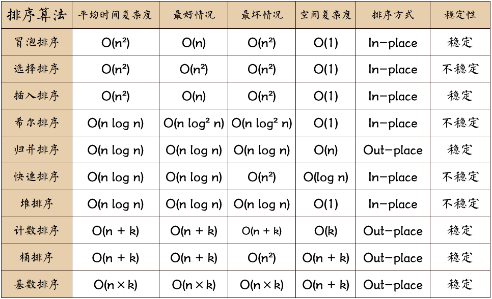

# 排序算法

备注:所有具体代码请看代码文件.

## 冒泡排序
### 介绍
对于一组要排序的元素列，依次比较相邻的两个数，将比较小的数放在前面，比较大的数放在后面，如此继续，直到比较到最后的两个数，将小数放在前面，大数放在后面，重复步骤，直至全部排序完成。冒泡排序就是通过相邻元素两两交换来让元素一点一点挪向有序位。
这个算法的名字由来是因为越大的元素会经由交换慢慢“浮”到数列的顶端（升序或降序排列），就如同碳酸饮料中二氧化碳的气泡最终会上浮到顶端一样，故名“冒泡排序”。

算法描述
- 步骤1: 比较相邻的元素。如果第一个比第二个大，就交换它们两个；
- 步骤2: 对每一对相邻元素作同样的工作，从开始第一对到结尾的最后一对，这样在最后的元素应该会是最大的数；
- 步骤3: 针对所有的元素重复以上的步骤，除了最后一个；
- 步骤4: 重复步骤1~3，直到排序完成。
### 参考排序过程

2 4 7 3 5 1

2 4 3 5 1 $\underline{7}$

2 3 4 1 $\underline{5 7}$

2 3 1 $\underline{4 5 7}$

2 1 $\underline{3 4 5 7}$

$\underline{123457}$

### 改进
冒泡排序的改进主要着手于两点

- 排序过程中已经有序的情况我们可以退出排序

- 一趟排序后可能有序的元素增加不止一个，如:
    3 4 2 1 5 6 7 8在第一趟排序后变成了3 4 1 2 $\underline{5 6 7 8}$,那么我们可以找到并标记来减少比较趟数。

## 选择排序
### 介绍
整个数组看成一个无序区间  每次从无序区间中选择最小（最大） 放入无序区间最前（最后）位置 ，一直到所有元素都排完

算法描述

- 步骤1：初始状态：无序区为R[1…n]，有序区为空；
- 步骤2：第i趟排序(i=1,2,3…n-1)开始时，当前有序区和无序区分别为R[1…i-1]和R(i…n）。该趟排序从当前无序区中-选出关键字最小的记录 R[k]，将它与无序区的第1个记录R交换，使R[1…i]和R[i+1…n)分别变为记录个数增加1个的新有序区和记录个数减少1个的新无序区；
- 步骤3：n-1趟结束，数组有序化了。

### 参考排序过程

2 4 7 3 5 1

$\underline{1}$ 4 7 3 5 2

$\underline{1 2}$ 4 7 3 5

$\underline{1 2 3}$ 7 4 5

$\underline{1 2 3 4}$ 7 5

$\underline{1 2 3 4 5 7}$

### 改进
选择排序可以改进为双向，即同时选择最大值和最小值，但是其中就出现一个问题，当数组中最大元素在第一个位置时 经过与min 交换 当前最大元素下标发生变更 需特殊处理

## 插入排序
### 介绍
通过构建有序序列，对于未排序数据，在已排序序列中从后向前扫描，找到相应位置并插入。

算法描述
- 步骤1: 从第一个元素开始，该元素可以认为已经被排序；
- 步骤2: 取出下一个元素，在已经排序的元素序列中从后向前扫描；
- 步骤3: 如果该元素（已排序）大于新元素，将该元素移到下一位置；
- 步骤4: 重复步骤3，直到找到已排序的元素小于或者等于新元素的位置；
- 步骤5: 将新元素插入到该位置后；
- 步骤6: 重复步骤2~5。

### 参考排序过程

2 4 7 3 5 1

$\underline{1}$ 2 4 7 3 5

$\underline{12}$ 4 7 3 5

$\underline{124}$ 7 3 5

$\underline{1247}$ 3 5

$\underline{12347}$ 5

$\underline{123457}$

### 改进
参考希尔排序

## 希尔排序
### 介绍
希尔排序是把记录按下表的一定增量分组，对每组使用直接插入排序算法排序；随着增量逐渐减少，每组包含的关键词越来越多，当增量减至1时，整个文件恰被分成一组，算法便终止。

算法描述
- 步骤1：选择一个增量序列t1，t2，…，tk，其中ti>tj，tk=1；
- 步骤2：按增量序列个数k，对序列进行k 趟排序；
- 步骤3：每趟排序，根据对应的增量ti，将待排序列分割成若干长度为m 的子序列，分别对各子表进行直接插入排序。仅增量因子为1 时，整个序列作为一个表来处理，表长度即为整个序列的长度。

### 参考排序过程

2 4 7 3 5 1

gap = 3:

2 4 1 3 5 7

gap = 2:

1 3 2 4 5 7

gap = 1:

1 2 3 4 5 7

## 归并排序
### 简介
将已有序的子序列合并，得到完全有序的序列；即先使每个子序列有序，再使子序列段间有序。若将两个有序表合并成一个有序表，称为2-路归并

其操作主要分为分与并两部分，其中分体现的分治思想，并利用的双指针。

算法描述
- 步骤1：把长度为n的输入序列分成两个长度为n/2的子序列；
- 步骤2：对这两个子序列分别采用归并排序；
- 步骤3：将两个排序好的子序列合并成一个最终的排序序列。

### 参考排序过程

2 4 1 3 5 7

2 4 1 # 3 5 7

2 4 # 1 # 3 5 # 7

1 2 4 # 3 5 7

1 2 3 4 5 7

### 改进
原地归并和结合插入排序两种优化方向

## 快速排序
### 介绍
通过一趟排序将待排记录分隔成独立的两部分，其中一部分记录的关键字均比另一部分的关键字小，则可分别对这两部分记录继续进行排序，以达到整个序列有序。

算法描述

- 步骤1：从数列中挑出一个元素，称为 “基准”（pivot ）；
- 步骤2：重新排序数列，所有元素比基准值小的摆放在基准前面，所有元素比基准值大的摆在基准的后面（相同的数可以到任一边）。在这个分区退出之后，该基准就处于数列的中间位置。这个称为分区（partition）操作；
- 步骤3：递归地（recursive）把小于基准值元素的子数列和大于基准值元素的子数列排序。

### 参考排序过程

2 4 1 3 5 7

1 $\underline{2}$ 4 3 5 7

$\underline{1234}$ 5 7

$\underline{123457}$

### 改进
彩虹快排

## 堆排序
### 介绍
堆排序（Heapsort） 是指利用堆这种数据结构所设计的一种排序算法。堆积是一个近似完全二叉树的结构，并同时满足堆积的性质：即子结点的键值或索引总是小于（或者大于）它的父节点。

算法描述
- 步骤1：将初始待排序关键字序列(R1,R2….Rn)构建成大顶堆，此堆为初始的无序区；
- 步骤2：将堆顶元素R[1]与最后一个元素R[n]交换，此时得到新的无序区(R1,R2,……Rn-1)和新的有序区(Rn),且满足R[1,2…n-1]<=R[n]；
- 步骤3：由于交换后新的堆顶R[1]可能违反堆的性质，因此需要对当前无序区(R1,R2,……Rn-1)调整为新堆，然后再次将R[1]与无序区最后一个元素交换，得到新的无序区(R1,R2….Rn-2)和新的有序区(Rn-1,Rn)。不断重复此过程直到有序区的元素个数为n-1，则整个排序过程完成

### 参考排序过程

2 4 1 3 5 7

构造大根堆:

7 4 5 2 3 1

排序:

5 4 1 2 3 7

4 3 1 2 5 7

3 2 1 4 5 7

1 2 3 4 5 7

### 改进
多叉堆

